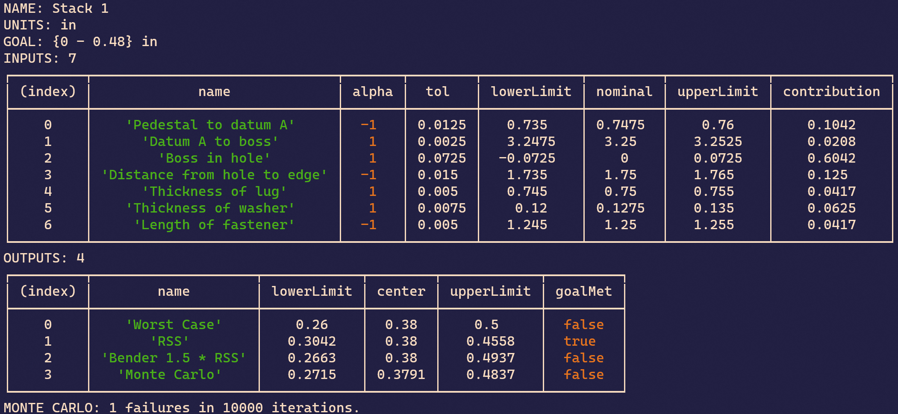

# Dimension Summation

## Features

- ASME/ISO dimension definitions
    - Symmetric
    - Bilateral
    - Limits
    - Profile
- Simultaneous analyses
    - Arithmetic mean
    - RSS
    - Bender 1.5 * RSS
    - Monte Carlo
- CLI
    - Output dimension table and results to console

## Current Progress



```js
stack1.addFeature("Pedestal to datum A", new DimSum.DimBilateral(.750, +.010, -.015), -1);
stack1.addFeature("Datum A to boss", new DimSum.DimBand(3.25, .005), 1);
stack1.addFeature("Boss in hole", new DimSum.AssemblyShift(new DimSum.DimBilateral(.625, +0, -0.010), new DimSum.DimSymmetric(.750, .010)), 1);
stack1.addFeature("Distance from hole to edge", new DimSum.DimSymmetric(1.75, .015), -1);
stack1.addFeature("Thickness of lug", new DimSum.DimSymmetric(0.75, .005), 1);
stack1.addFeature("Thickness of washer", new DimSum.DimLimits(.135, .120), 1);
stack1.addFeature("Length of fastener", new DimSum.DimSymmetric(1.25, .005), -1);
```
